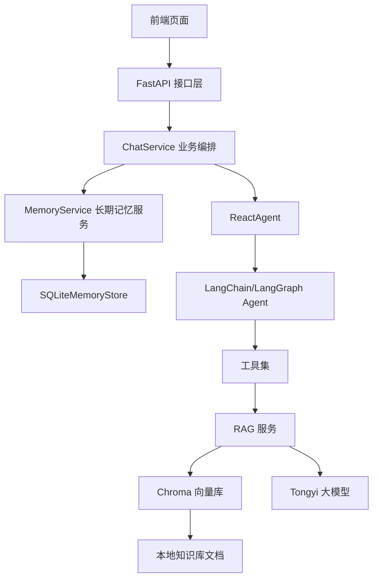

# 客户服务 Agent 项目面试自用技术文档

## 1. 这份文档是干什么的

这不是项目交接文档，也不是写给别人看的标准说明书，而是我自己在面试前用来快速复盘项目的技术笔记。

我写这份文档的目标只有三个：

- 帮我快速讲清楚这个项目是做什么的
- 帮我说明项目为什么这样分层、为什么这样选技术
- 帮我在面试里把每个模块“怎么实现的”讲具体

所以这份文档会重点写：

- 项目整体定位
- 分层结构和分层原因
- 核心功能模块的实现方式
- 使用到的技术和这样选的原因
- 当前版本的不足和后续优化点

前端部分只看 API 交互，不展开页面代码细节。

---

## 2. 我怎么一句话介绍这个项目

这是一个基于 `FastAPI + LangChain/LangGraph + RAG + SQLite 长期记忆` 实现的智能客服问答系统，场景聚焦在扫地机器人/扫拖一体机器人咨询。它支持知识库问答、会话级短期记忆、用户级长期记忆，以及基于流式接口的前后端交互。

如果面试官让我再展开一点，我会这样说：

> 我做的是一个智能客服 Agent 原型系统。后端用 FastAPI 提供接口，问答核心用了 Agent + RAG，知识库放在 Chroma 里，长期记忆放在 SQLite 里。系统把 `session_id` 和 `user_id` 分开管理，前者处理当前会话上下文，后者处理跨会话用户记忆。这样既能支持连续对话，也能让系统“记住用户”。

---

## 3. 这个项目解决什么问题

这个项目主要解决的是一个“智能客服问答链路落地”的问题，而不是单纯做一个聊天页面。

我想解决的核心问题有四个：

1. 用户提问题后，系统不能只靠大模型裸答，要结合企业自己的知识库回答。
2. 对同一个会话，系统要能记住前几轮上下文。
3. 对同一个用户，系统要能跨会话保留一些长期有价值的信息，比如预算、设备型号、偏好。
4. 前后端要通过标准接口联调，形成一个完整可运行的 Demo。

所以这个项目的本质是一个“可运行的智能客服后端原型”，前端只是为了验证接口和交互链路。

---

## 4. 项目整体结构

项目目录如下：

```text
customer_service_agent/
├── backend/
│   ├── app/
│   │   ├── api/                 # API 接口层
│   │   ├── agents/              # Agent、工具、Prompt、中间件
│   │   ├── core/                # 配置、路径、日志
│   │   ├── infra/               # LLM、向量库、文件加载、SQLite
│   │   ├── services/            # 业务编排层
│   │   └── main.py              # FastAPI 启动入口
│   ├── data/                    # 知识库原始数据、外部模拟数据、长期记忆库
│   ├── chroma_db/               # Chroma 持久化目录
│   └── logs/                    # 日志目录
├── config/                      # YAML 配置文件
├── frontend/                    # 静态前端页面
├── requirements.txt
└── 技术文档.md
```

---

## 5. 为什么要这样分层

这个项目虽然不大，但我还是故意做了分层，而不是把逻辑全部堆在一个 `app.py` 里。原因主要有四个。

### 5.1 API 层和业务层要分开

接口层只负责接收请求、校验参数、返回响应，不直接写业务细节。

这样做的好处：

- 路由函数会比较薄，容易看
- 业务逻辑能复用
- 后面如果改成别的协议，比如 WebSocket、任务队列，也不需要重写核心逻辑

### 5.2 Agent 逻辑和基础设施要分开

Agent 是业务策略层，像大模型、向量库、SQLite 这些属于基础设施。

这样分开之后：

- Agent 只关心“我怎么决策、调什么工具”
- `infra` 只关心“模型怎么初始化、向量库怎么读写、SQLite 怎么操作”

这能避免 Agent 层直接依赖太多底层细节。

### 5.3 Service 层负责“编排”

像聊天流程这种需求，本质上不是一个简单 CRUD，而是一个链路编排：

- 先读长期记忆
- 再执行 Agent
- 再回传流式结果
- 最后落长期记忆

这类逻辑放在 `services` 最合适，因为它不是路由，也不是底层工具，而是“把多个模块串起来”。

### 5.4 core 层统一放公共能力

配置、路径、日志这种东西在多个模块都会用到，如果分散在各处，后面维护很乱。

所以我单独抽了 `core`：

- `config.py` 负责读 YAML
- `paths.py` 负责统一项目绝对路径
- `logger.py` 负责日志

这样能减少硬编码和重复代码。

---

## 6. 整体架构怎么讲

如果面试官问整体架构，我会按下面这条链路讲：



我会把它总结成一句：

> 请求先走 API，再由 Service 编排，Agent 负责推理和工具调用，RAG 负责知识增强，SQLite 负责长期记忆，前端通过流式接口消费最终结果。

---

## 7. 项目用到了什么技术

### 7.1 后端框架

- `FastAPI`
- `uvicorn`
- `Pydantic v2`

为什么选 `FastAPI`：

- 接口开发快
- 参数校验天然支持
- 自动生成 Swagger 文档
- 对流式响应支持比较友好

### 7.2 Agent 与大模型编排

- `LangChain`
- `LangGraph`

为什么用这套：

- 项目目标不是直接调一次模型，而是要做“Agent + 工具 + 上下文”
- LangChain 工具接入比较快
- LangGraph 能管理 Agent 的执行状态和会话记忆

### 7.3 RAG

- `Chroma`
- `DashScopeEmbeddings`
- 本地知识库文档切块检索

为什么这样选：

- Chroma 对本地原型项目足够轻量
- 适合先把知识库问答链路跑通
- 本地持久化方便，不需要额外部署复杂数据库

### 7.4 存储

- `SQLite`

为什么长期记忆先用 SQLite：

- 原型阶段实现成本低
- 不依赖独立数据库服务
- 数据结构又足够简单，适合用户画像和记忆条目存储

### 7.5 配置管理

- `YAML`

为什么不用把配置写死在代码里：

- 模型名、知识库路径、记忆库路径都可能改
- 配置外置后，后面替换模型或目录更容易

---

## 8. 核心流程怎么实现

这个项目最重要的是“问答主链路”。面试里我会重点讲这一段。

### 8.1 请求从哪里进入

入口文件是：

- `backend/app/main.py`

这里做了几件事：

- 初始化 `FastAPI`
- 配置 `CORS`
- 注册路由

当前实际挂载的接口核心是聊天接口：

- `POST /api/v1/chat/stream`

这个接口在：

- `backend/app/api/v1/routes/chat.py`

它接收一个 `ChatRequest`：

- `query`
- `session_id`
- `user_id`

这里我会强调一个设计点：

> 我把 `session_id` 和 `user_id` 拆开了。`session_id` 管当前会话上下文，`user_id` 管跨会话长期记忆。这样“清空会话”和“忘记用户”不是一个概念。

### 8.2 为什么接口用流式返回

聊天接口返回的是：

- `text/event-stream`

也就是 SSE 风格流式响应。

我这样做的原因：

- 聊天场景天然适合流式体验
- 前端可以先展示“正在思考中...”
- 后续如果要扩展成逐步输出，也不需要推翻协议

虽然当前版本实际上只给前端发了一个 `snapshot` 和一个 `final`，但协议已经按流式做了，这样后面扩展空间更大。

### 8.3 ChatService 怎么编排

核心文件：

- `backend/app/services/chat_service.py`

`ChatService` 主要负责把各个模块串起来。流程是：

1. 根据 `user_id` 读取长期记忆
2. 构造 `memory_context`
3. 调用 Agent 执行
4. 把结果包装成 SSE 事件
5. 回答结束后提取并保存长期记忆

我在面试里会这么描述它的职责：

> `ChatService` 本质上是问答链路的编排器，不负责底层存储，也不负责接口入参校验，而是专门负责把“长期记忆 + Agent + 流式输出”整合成一条完整链路。

### 8.4 Agent 怎么实现

核心文件：

- `backend/app/agents/react_agent.py`

这里我用了 `create_agent()` 去创建 Agent，并且给它注册了：

- 模型
- 系统 Prompt
- 工具
- 中间件
- checkpointer

当前用到的工具包括：

- `rag_summarize`
- `get_weather`
- `get_user_location`
- `get_user_id`
- `get_current_month`
- `fetch_external_data`
- `fill_context_for_report`

这里我会主动说明一个点：

> 这个版本里真正业务价值最高的是 `rag_summarize` 和长期记忆注入，其他工具更多是为了验证 Agent 调工具的能力和后续扩展位。

### 8.5 短期记忆怎么实现

短期记忆是通过：

- `LangGraph` 的 `InMemorySaver`

来做的。

执行时把：

- `session_id -> thread_id`

这样同一个 `session_id` 下的多轮对话，就会自动延续上下文。

我为什么先这样做：

- 原型阶段先把链路跑通
- 成本低，接入快
- 不需要先上 Redis 或数据库

但我也会主动说它的局限：

- 服务重启后短期记忆会丢
- 只适合 Demo 或单机验证

### 8.6 长期记忆怎么实现

核心文件：

- `backend/app/services/memory_service.py`
- `backend/app/infra/memory/sqlite_store.py`

我把长期记忆拆成两部分：

1. 用户画像
2. 历史记忆条目

对应 SQLite 两张表：

- `user_profiles`
- `user_memories`

为什么这么拆：

- 用户画像字段相对结构化，比如姓名、地区、预算、型号
- 历史记忆更偏文本，比如“上次问过门槛能力”“用户强调更看重静音”

这样拆的好处：

- 查询更清晰
- 更新策略更清晰
- 后续扩展也更方便

### 8.7 长期记忆注入逻辑

`MemoryService.build_memory_context()` 会做两件事：

1. 读用户画像
2. 读和当前 query 相关的历史记忆

然后把它们组织成一个结构化文本块，例如：

- 用户所在城市
- 设备型号
- 是否养宠物
- 预算范围
- 已知偏好
- 相关历史记忆

再以 `[长期记忆]` 的形式注入给 Agent。

我这样做的原因是：

- 不把整段历史对话直接塞给模型，避免上下文污染
- 只保留“稳定信息”和“有长期价值的信息”
- 能让模型更容易理解哪些是长期背景

### 8.8 长期记忆抽取逻辑

当前不是让模型去抽记忆，而是规则抽取。

抽取规则包括：

- 地点
- 姓名
- 产品型号
- 预算
- 是否有宠物
- 偏好关键词
- 故障/问题背景
- 明确要求“记住”的偏好

为什么先做规则抽取，而不是直接做 LLM 抽取：

- 原型阶段更稳定
- 更可解释
- 成本更低
- 更容易调试

我在面试里会主动补一句：

> 这是一个典型的工程取舍。第一版先用规则把链路跑通，等后面数据和场景稳定后，再升级成模型抽取或混合抽取。

### 8.9 RAG 怎么实现

核心文件：

- `backend/app/agents/support/rag_support.py`
- `backend/app/infra/vectorstore/chroma_store.py`
- `backend/app/infra/files/file_loader.py`

RAG 的处理流程是：

1. 读取本地知识库文件
2. 按配置切块
3. 用 Embedding 模型做向量化
4. 写入 Chroma
5. 查询时先检索 TopK 文档片段
6. 把片段拼成上下文交给大模型总结

当前配置大概是：

- 知识库目录：`backend/data`
- 持久化目录：`backend/chroma_db`
- 支持文件：`txt`、`pdf`
- TopK：`3`
- chunk_size：`200`
- overlap：`20`

### 8.10 为什么知识库初始化做成自动化

RAG 服务里有一个设计是：

- 如果检测不到向量库持久化目录或 MD5 文件
- 就自动执行知识库初始化

这样做的好处：

- 新环境启动更方便
- 项目演示更顺滑
- 不需要手动先跑一套“构建索引”的脚本

同时我还做了 MD5 去重，避免相同文件重复入库。

---

## 9. 前端部分在面试里怎么讲

前端我不会展开页面代码，而是只讲它承担的职责。

前端核心文件是：

- `frontend/app.js`

它的职责不是做复杂业务，而是：

- 收集用户输入
- 本地保存 `session_id`
- 本地保存 `user_id`
- 调用后端流式接口
- 解析 SSE 数据
- 展示最终答案

这里我会强调一个点：

> 前端现在是轻量验证层，真正的业务状态和记忆管理都放在后端。这样后面无论换 Web 页面、桌面端还是小程序，后端核心能力都能复用。

---

## 10. API 设计要点

面试时如果被问接口，我主要讲两个接口。

### 10.1 健康检查接口

- `GET /api/v1/health`

作用：

- 验证服务是否启动成功

### 10.2 聊天接口

- `POST /api/v1/chat/stream`

请求体：

```json
{
  "query": "当前环境下应该怎么保养机器人？",
  "session_id": "demo-session-id",
  "user_id": "demo-user-id"
}
```

返回协议：

- `text/event-stream`

事件格式：

```text
data: {"type":"snapshot","content":"正在思考中..."}

data: {"type":"final","content":"最终答案"}
```

我会重点说清楚这三个字段的意义：

- `query`：当前用户问题
- `session_id`：当前会话上下文
- `user_id`：当前用户身份

这个拆分是这个项目里我自己觉得比较关键的设计点之一。

---

## 11. 配置模块怎么实现

核心文件：

- `backend/app/core/config.py`
- `backend/app/core/paths.py`

我把配置统一放在 `config/` 下，用 YAML 管理，当前包括：

- `rag.yml`
- `chroma.yml`
- `agent.yml`
- `memory.yml`
- `prompts.yml`

为什么这么做：

- 模型名称可能变
- 知识库路径可能变
- 向量库参数可能变
- Prompt 文件路径也可能变

如果都写死在代码里，后面维护会很痛苦。

`paths.py` 的作用是把相对路径统一转换成项目根目录下的绝对路径，避免不同模块各自拼路径。

---

## 12. 每个模块我在面试里怎么展开

这部分是给我自己背诵用的。

### 12.1 `api`

这是接口层，职责是定义 HTTP 路由和请求模型。

里面主要有：

- `routes/chat.py`
- `routes/health.py`
- `schemas/chat.py`

我会说：

> 这一层我刻意保持很薄，只做入参接收和响应返回，不把核心业务塞进路由函数里。

### 12.2 `services`

这是业务编排层。

里面主要有：

- `chat_service.py`
- `memory_service.py`

我会说：

> `chat_service` 负责串链路，`memory_service` 负责长期记忆逻辑。这样拆开以后，问答流程和记忆逻辑不会耦在一起。

### 12.3 `agents`

这是智能体能力层。

里面主要有：

- `react_agent.py`
- `tools/agent_tools.py`
- `support/rag_support.py`
- `support/prompt_support.py`
- `middleware.py`

我会说：

> 这一层主要放“模型怎么推理、工具怎么调、Prompt 怎么组织”，属于整个系统最智能的一层。

### 12.4 `infra`

这是基础设施层。

里面主要有：

- `llm/factory.py`
- `vectorstore/chroma_store.py`
- `memory/sqlite_store.py`
- `files/file_loader.py`

我会说：

> 这一层是技术底座，负责把模型、向量库、文件系统和数据库这些底层能力封装起来，让上层只关注业务。

### 12.5 `core`

这是公共基础层。

里面主要有：

- `config.py`
- `paths.py`
- `logger.py`

我会说：

> 这个层解决的是全项目通用问题，比如配置读取、路径定位和日志记录。

---

## 13. 这个项目里我认为最能体现思考的点

如果面试官问“这个项目里你觉得你设计得比较好的点是什么”，我会讲这几个。

### 13.1 `session_id` 和 `user_id` 分离

这是为了区分：

- 会话级短期记忆
- 用户级长期记忆

这样用户清空当前聊天时，不会把长期记忆一起抹掉。

### 13.2 用 Service 层做链路编排

不是把逻辑塞在路由里，也不是塞进 Agent 里，而是单独做一个编排层。

这让职责边界更清楚。

### 13.3 长期记忆先做规则抽取

这是一个工程上的取舍，不是技术上做不到 LLM 抽取，而是第一版更看重：

- 稳定
- 可解释
- 易调试
- 成本低

### 13.4 RAG 自动初始化 + MD5 去重

这样项目在新环境里更容易跑起来，也避免知识库重复导入。

---

## 14. 当前版本的不足

这个部分面试时我不会回避，反而会主动说，因为这能体现我知道系统边界在哪里。

当前不足主要有：

1. 短期记忆是 `InMemorySaver`，服务重启会丢。
2. 长期记忆检索还是关键词匹配，不是语义检索。
3. 长期记忆抽取还是规则式，不是模型抽取。
4. 一些工具能力目前还是模拟数据，不是真实业务系统接入。
5. SSE 现在只是轻量实现，还没有更完整的事件定义和异常恢复机制。
6. 没有补充分层测试、接口测试和生产部署方案。

---

## 15. 如果继续迭代，我会怎么优化

这个部分是“下一步计划”，面试里可以体现思路。

### 15.1 记忆系统升级

- 把短期记忆从内存迁移到 Redis 或数据库
- 把长期记忆检索从关键词匹配升级为向量检索
- 把长期记忆抽取改成规则 + LLM 混合方案

### 15.2 RAG 升级

- 增加知识库元数据管理
- 做增量更新和重建机制
- 增强检索结果可解释性

### 15.3 工程化升级

- 增加单元测试和接口测试
- 补环境变量管理
- 做 Docker 化部署
- 增加日志、监控和异常治理

### 15.4 业务能力升级

- 接真实天气服务和真实用户服务
- 增加会话管理后台
- 增加知识库管理后台
- 增加报告生成能力

---

## 16. 面试时我可以直接背的项目总结

我可以这样总结这个项目：

> 这个项目是一个智能客服 Agent 原型系统，我重点做的是后端问答链路。整体上我把系统分成 API、Service、Agent、Infra、Core 五层，目的是把接口、业务编排、智能体逻辑和底层依赖拆开。核心链路是：前端把 query、session_id、user_id 发给后端，后端先读长期记忆，再执行 Agent，Agent 根据需要调用 RAG，从 Chroma 检索知识库内容，再结合大模型生成答案，最后把和用户有关的稳定信息抽出来写入 SQLite。这个项目里我比较强调的设计点是短期记忆和长期记忆分离，以及第一版优先选择稳定、可解释、可快速落地的工程方案，比如规则式长期记忆抽取和本地化的 Chroma/SQLite 存储。  

如果面试官继续追问，我就按模块往下展开：

- 为什么分层
- 问答链路怎么走
- RAG 怎么做
- 长期记忆怎么做
- 为什么这样选技术
- 当前不足和下一步优化

---

## 17. 我复盘这个项目时最该记住的关键词

- 智能客服 Agent
- FastAPI
- LangChain / LangGraph
- RAG
- Chroma
- SQLite 长期记忆
- `session_id` / `user_id` 分离
- Service 编排
- SSE 流式接口
- 规则式长期记忆抽取
- 原型阶段的工程取舍
