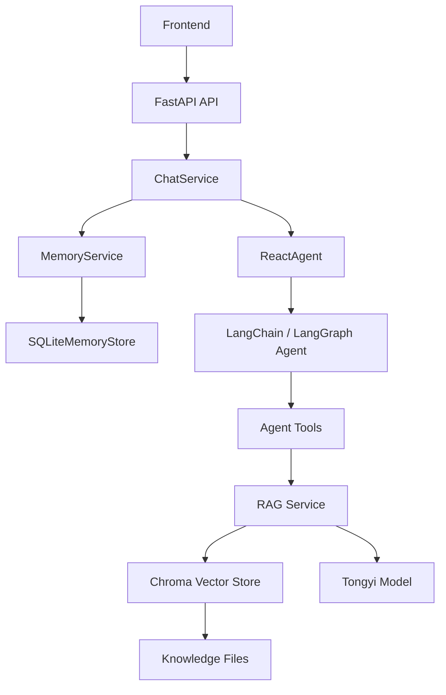

# 客户服务 Agent 项目技术文档

## 1. 项目介绍 + 技术栈

### 1.1 项目介绍

这是一个面向智能客服场景的 Agent 问答系统，当前业务场景聚焦在扫地机器人、扫拖一体机器人相关咨询。项目目标不是单纯做一个聊天页面，而是打通一条完整的“智能客服问答链路”：

- 前端收集用户问题并发起请求
- 后端接收请求后调用 Agent
- Agent 按需调用 RAG、工具和记忆能力
- 系统结合知识库、会话上下文和用户长期记忆生成回答
- 最终通过流式接口把结果返回给前端

这个项目的核心价值在于把下面几种能力组合到了一起：

- 基于知识库的问答
- Agent 工具调用
- 会话级短期记忆
- 用户级长期记忆
- SSE 流式输出

如果用一句话概括这个项目：

> 这是一个基于 `FastAPI + LangChain/LangGraph + RAG + 长期记忆` 实现的智能客服 Agent 原型系统。

### 1.2 项目目标

这个项目主要想解决 4 个问题：

1. 回答不能只靠大模型裸答，要结合企业知识库内容。
2. 同一轮会话里，系统要记住上下文。
3. 跨会话场景下，系统要能记住用户画像和长期偏好。

### 1.3 项目特点

- 后端是系统核心，前端相对轻量
- 强调分层设计，便于讲清楚工程结构
- RAG 和长期记忆是最有业务价值的两个重点模块
- 流式输出增强了真实对话体验
- 当前版本偏原型验证，但核心链路已经完整

---

## 2. 技术栈

### 2.1 后端技术栈

- `FastAPI`：提供 HTTP API
- `Uvicorn`：运行 FastAPI 服务
- `Pydantic v2`：请求参数校验
- `LangChain`：Agent、工具调用、Prompt 组织
- `LangGraph`：会话状态与短期记忆管理
- `Chroma`：本地向量数据库
- `DashScopeEmbeddings`：文本向量化
- `ChatTongyi`：对话大模型
- `SQLite`：长期记忆存储
- `PyYAML`：配置文件读取

### 2.2 前端技术栈

- `HTML`
- `CSS`
- `JavaScript`
- `Fetch API`
- `ReadableStream`
- `SSE 风格事件解析`

### 2.3 为什么这样选技术

#### 为什么用 FastAPI

- 开发接口效率高
- 自带参数校验能力
- 调试方便
- 很适合快速搭建原型

#### 为什么用 LangChain / LangGraph

- 项目不是简单的一次性模型调用，而是“模型 + 工具 + 记忆 + Prompt”
- LangChain 适合快速封装 Agent 和工具
- LangGraph 提供了更适合多轮对话的状态管理能力

#### 为什么用 Chroma

- 轻量，适合本地开发和原型验证
- 容易和 LangChain 集成
- 不需要额外部署复杂的向量数据库服务

#### 为什么用 SQLite 存长期记忆

- 原型阶段足够用
- 实现成本低
- 方便本地演示和调试

#### 为什么前端保持轻量

- 这个项目重点在后端问答能力
- 前端主要用于验证接口和交互效果
- 后面更换客户端时，后端能力仍然可以复用

---

## 3. 项目架构 + 原理

### 3.1 项目目录结构

```text
customer_service_agent/
├── backend/
│   ├── app/
│   │   ├── api/                 # API 接口层
│   │   ├── agents/              # Agent、工具、Prompt、中间件
│   │   ├── core/                # 配置、路径、日志
│   │   ├── infra/               # LLM、向量库、文件、SQLite
│   │   ├── services/            # 业务编排层
│   │   └── main.py              # 服务入口
│   ├── data/                    # 知识库文档、外部模拟数据、长期记忆数据
│   ├── chroma_db/               # Chroma 持久化目录
│   └── logs/                    # 日志
├── config/                      # YAML 配置
├── frontend/                    # 前端页面
├── requirements.txt
└── 技术文档.md
```

### 3.2 分层架构

后端分成 5 层：

- `api`：只负责接口暴露和参数接收
- `services`：负责把多个能力编排成完整业务流程
- `agents`：负责模型推理、工具调用、Prompt 和 Agent 能力
- `infra`：负责底层技术实现，比如向量库、SQLite、文件加载、模型初始化
- `core`：负责公共基础能力，比如配置、日志、路径

### 3.3 为什么这么分层

#### API 层

API 层只做“接请求”和“回响应”，不直接写复杂业务逻辑。

这样做的好处：

- 路由函数更清晰
- 逻辑更容易复用
- 接口层和业务层解耦

#### Service 层

Service 层解决的是“链路编排”问题。

比如一次问答不是一个简单 CRUD，而是：

- 读长期记忆
- 调用 Agent
- 处理流式输出
- 回答结束后回写长期记忆

这类逻辑放在 `services` 最合适。

#### Agent 层

Agent 层负责“智能行为”本身，包括：

- 系统 Prompt
- 工具注册
- 工具调用
- 会话状态管理

这样可以把“智能决策”和“底层存储实现”分开。

#### Infra 层

Infra 层负责封装底层依赖，包括：

- 大模型初始化
- 向量库构建与检索
- SQLite 数据存储
- 文件加载

这样上层业务就不需要感知太多底层细节。

#### Core 层

Core 层放项目级通用能力：

- 配置读取
- 路径处理
- 日志记录

避免各处硬编码和重复逻辑。

### 3.4 整体架构图



### 3.5 系统原理

系统整体原理可以概括为：

1. 前端发起用户问题
2. 后端读取用户长期记忆
3. Agent 结合系统 Prompt、长期记忆、短期会话上下文进行推理
4. 如果需要知识库支持，就调用 RAG 从向量库检索资料
5. 如果需要额外信息，就调用工具
6. 后端把最终回答以流式方式返回
7. 回答结束后，再从本轮用户输入中提取长期记忆并持久化

其中最关键的两个原理是：

- `RAG`：让系统从知识库里找资料后再回答，而不是纯靠模型记忆
- `长期记忆`：让系统跨会话记住用户画像和偏好

---

## 4. 核心流程

### 4.1 整体流程

一次完整问答的大致流程如下：

1. 用户在前端输入问题
2. 前端生成或读取 `session_id` 与 `user_id`
3. 前端请求 `POST /api/v1/chat/stream`
4. 路由层调用 `ChatService.event_stream()`
5. `ChatService` 先通过 `MemoryService` 构造长期记忆上下文
6. `ChatService` 调用 `ReactAgent.execute_stream()`
7. Agent 根据问题和 Prompt 决定是否调用工具或 RAG
8. 如果调用 RAG，就从 Chroma 检索知识库内容，并交给模型总结
9. 后端先返回 `snapshot`
10. 最终答案生成后，先写入长期记忆
11. 再把最终答案拆成多个 `delta` 事件逐字推给前端
12. 最后再发送一次 `final` 事件作为收口

### 4.2 请求入口

请求入口在：

- `backend/app/api/v1/routes/chat.py`

接口定义：

- `POST /api/v1/chat/stream`

接收的请求体核心字段：

- `query`
- `session_id`
- `user_id`

这个设计里有一个很重要的点：

- `session_id` 负责短期记忆
- `user_id` 负责长期记忆

也就是说：

- 清空会话不等于忘记用户
- 同一个用户可以开启多个新会话，但长期信息仍然保留

### 4.3 SSE 输出流程

流式输出由 `ChatService.event_stream()` 实现。

当前返回的是 `text/event-stream`，并带了适合 SSE 的响应头：

- `Cache-Control: no-cache`
- `Connection: keep-alive`
- `X-Accel-Buffering: no`

事件类型分为三类：

- `snapshot`
- `delta`
- `final`

输出顺序是：

1. 先发 `snapshot`，告诉前端“正在思考中...”
2. 等最终答案确定后，逐字发送 `delta`
3. 最后发 `final`，把完整答案再返回一遍

这样设计的原因：

- 前端能实时感知“系统在工作”
- 有逐字流式效果，体验更像真实对话
- `final` 事件又能作为完整结果兜底

### 4.4 长期记忆写入时机

长期记忆不是在流式过程中边输出边写，而是：

- 先得到最终答案
- 再调用 `extract_and_save()`
- 最后才逐字发 `delta`

这样做的原因是：

- 避免中途增量输出时重复写入
- 避免答案尚未稳定时就把内容持久化
- 保持链路更清晰

---

## 5. 详细描述功能

这一部分重点展开项目功能是怎么实现的。

### 5.1 后端

#### 5.1.1 RAG（重点）

RAG 是这个项目最核心的能力之一。

##### RAG 解决什么问题

如果只靠大模型直接回答，会有几个问题：

- 容易幻觉
- 不能保证和企业知识一致
- 对垂直领域知识掌握不稳定

所以我引入 RAG，让系统先“检索知识”，再“基于知识回答”。

##### RAG 的实现模块

核心文件：

- `backend/app/agents/support/rag_support.py`
- `backend/app/infra/vectorstore/chroma_store.py`
- `backend/app/infra/files/file_loader.py`

##### RAG 的数据来源

知识库文档放在：

- `backend/data`

当前支持的文件类型：

- `txt`
- `pdf`

##### RAG 的实现流程

1. 从 `backend/data` 扫描知识库文件
2. 根据文件类型选择不同 loader
3. 把文档切成较小的 chunk
4. 使用 Embedding 模型把文本向量化
5. 写入 Chroma 向量库
6. 用户提问时，从向量库检索 TopK 相关片段
7. 把检索结果组织成 `context`
8. 再通过 RAG Prompt 让模型基于上下文生成回答

##### 文档切块实现

项目使用了 `RecursiveCharacterTextSplitter`。

当前配置大致是：

- `chunk_size = 200`
- `chunk_overlap = 20`

为什么需要切块：

- 原始文档可能太大，不能整篇直接塞给模型
- 切块后检索粒度更细
- 更容易召回和问题相关的局部内容

##### 向量库实现

向量库使用的是 `Chroma`。

当前配置里关键参数有：

- collection name
- 持久化目录
- 检索 `k`
- 文档来源目录

为什么选 Chroma：

- 适合原型项目
- 容易本地持久化
- 和 LangChain 集成方便

##### 知识库初始化策略

RAG 服务启动时会检测：

- 持久化目录是否存在
- MD5 文件是否存在

如果没有，就自动初始化知识库。

这里还做了 `MD5` 去重，作用是：

- 避免同一份文档重复入库
- 方便增量维护知识库

##### RAG 为什么是重点

因为这个项目不是纯聊天项目，它的业务价值主要来自“回答要专业、要可控、要贴合业务知识”。而 RAG 正是把业务知识和大模型回答结合起来的核心。

面试里我可以这样讲：

> 这个项目里，RAG 的作用是把企业知识库接进问答链路，让系统回答更稳定、更专业。实现上我做了文档加载、切块、向量化、Chroma 存储和召回，再用 Prompt 把召回结果交给模型总结。

#### 5.1.2 工具调用

Agent 工具定义在：

- `backend/app/agents/tools/agent_tools.py`

当前工具包括：

- `rag_summarize`
- `get_weather`
- `get_user_location`
- `get_user_id`
- `get_current_month`
- `fetch_external_data`
- `fill_context_for_report`

##### 工具调用怎么实现

这些函数通过 `@tool` 注册为 Agent 可调用工具。Agent 在推理时会根据问题内容决定是否调用某个工具。

##### 工具调用的意义

- `rag_summarize`：把知识库能力接进 Agent
- `fetch_external_data`：模拟外部业务系统查询
- 其他工具：用于演示 Agent 决策和扩展位

##### 为什么工具调用有价值

因为真实的智能客服系统不可能只靠模型本身，它一定需要和外部知识、外部系统、业务规则结合。工具调用就是连接模型和业务能力的桥梁。

#### 5.1.3 流式输出

流式输出实现主要在：

- `backend/app/api/v1/routes/chat.py`
- `backend/app/services/chat_service.py`

##### 怎么实现

路由层使用 `StreamingResponse` 返回：

- `media_type = "text/event-stream"`

Service 层按 SSE 格式不断 `yield`：

- `snapshot`
- `delta`
- `final`

##### 当前实现细节

- `snapshot`：占位提示
- `delta`：把最终答案拆成字符级增量
- `final`：完整答案收口

同时代码里加入了：

- `stream_delay = 0.02`

它的作用是让前端逐字效果更自然，而不是一下子全部刷出来。

##### 为什么这样做

- 增强交互体验
- 更符合聊天系统认知
- 保留完整答案兜底

#### 5.1.4 短期记忆

短期记忆主要由：

- `LangGraph checkpointer`
- `InMemorySaver`

实现。

##### 怎么实现

在 `ReactAgent` 中，Agent 初始化时注册了 `checkpointer`。每次请求时把：

- `session_id -> thread_id`

这样同一个 `session_id` 的多轮对话，会自动串联上下文。

##### 为什么这么设计

- 简单直接
- 原型阶段接入快
- 能快速验证多轮对话能力

##### 当前局限

- 只存在内存中
- 服务重启后会丢失

#### 5.1.5 长期记忆（重点）

长期记忆是这个项目另一个重点模块。

##### 长期记忆解决什么问题

短期记忆只能解决当前会话上下文问题，但客服系统很多信息应该跨会话保留，比如：

- 用户住在哪
- 用户预算多少
- 用户家里有没有宠物
- 用户更看重静音还是拖地能力
- 用户以前问过什么问题

所以必须把用户长期信息独立出来。

##### 长期记忆的实现模块

核心文件：

- `backend/app/services/memory_service.py`
- `backend/app/infra/memory/sqlite_store.py`

##### 存储设计

长期记忆使用 SQLite，分两张表：

- `user_profiles`
- `user_memories`

为什么分两张表：

- `user_profiles` 存结构化、稳定的信息
- `user_memories` 存文本型、事件型记忆

这样设计更符合真实业务，也更利于后面扩展。

##### 长期记忆注入怎么实现

`MemoryService.build_memory_context()` 会做两步：

1. 读取用户画像
2. 读取与当前 query 相关的历史记忆

再把这些内容组织成统一的 `memory_context` 注入 Agent。

注入内容包括：

- 姓名
- 城市
- 产品型号
- 户型
- 预算
- 是否养宠物
- 偏好
- 历史记忆条目

##### 为什么要单独构造 memory_context

因为长期记忆和聊天历史不是一回事：

- 聊天历史是原始消息序列
- 长期记忆是提炼后的稳定背景信息

把长期记忆单独组织出来，可以：

- 减少上下文污染
- 提高模型理解效率
- 更方便后续替换注入策略

##### 长期记忆检索怎么实现

当前版本没有做语义记忆检索，而是：

- 先把 query 按规则拆成关键词
- 再到记忆条目里做字符串匹配
- 如果没匹配到，再回退到最近几条记忆

这是一个偏工程化的第一版方案。

优点：

- 稳定
- 实现简单
- 可解释

缺点：

- 语义能力有限
- 泛化不如向量检索

##### 长期记忆抽取怎么实现

当前是规则抽取，不是模型抽取。

识别内容包括：

- 姓名
- 地点
- 产品型号
- 预算
- 户型
- 是否有宠物
- 偏好关键词
- 历史问题背景

比如用户说：

- 我住杭州
- 我家里有猫
- 预算 3000 以内
- 我更看重静音

系统就能把这些信息提炼后写入 SQLite。

##### 为什么长期记忆是重点

因为它能让系统从“会回答问题”升级为“记住用户后再回答问题”。这更接近真实客服系统。

面试里我可以这样讲：

> 长期记忆是这个项目里我重点做的第二块能力。我把用户画像和历史记忆分开存储，用 SQLite 落地；在请求开始时先构造 memory_context 注入给 Agent，在请求结束后再从用户输入里抽取新的长期信息回写。这样系统可以跨会话记住用户偏好和背景信息。

#### 5.1.6 提示词工程

Prompt 相关逻辑主要在：

- `backend/app/agents/support/prompt_support.py`
- `backend/app/agents/prompts/`

当前项目里至少有几类 Prompt：

- 主系统 Prompt
- RAG 总结 Prompt
- 报告生成 Prompt

##### 提示词工程怎么做

我没有把 Prompt 写死在代码里，而是：

- 把 Prompt 文件单独存放
- 在配置里维护路径
- 运行时读取

这样做的好处：

- Prompt 更容易单独调优
- 改 Prompt 不需要大量改代码
- 更适合后续实验不同版本

##### 长期记忆和 Prompt 的关系

长期记忆会通过额外上下文注入 Prompt。这样模型在回答前，就已经知道：

- 这个用户是谁
- 有什么偏好
- 以前发生过什么

这能显著提高回答的连贯性和个性化程度。

#### 5.1.7 API 与配置管理

##### API

核心接口目前是：

- `POST /api/v1/chat/stream`

健康检查能力在当前代码中不是这次重点，但聊天接口已经完整构成主链路。

##### 配置管理

配置集中放在：

- `config/rag.yml`
- `config/chroma.yml`
- `config/agent.yml`
- `config/memory.yml`
- `config/prompts.yml`

统一由 `backend/app/core/config.py` 加载。

这样做的目的是让模型名、向量库参数、知识库路径、Prompt 路径都可以独立调整。

---

### 5.2 前端

前端核心文件是：

- `frontend/app.js`

前端不是这个项目的重点，但它承担了验证后端链路的重要角色。

#### 5.2.1 前端主要功能

- 收集用户输入
- 保存 `session_id`
- 保存 `user_id`
- 发起聊天请求
- 解析 SSE 数据
- 实时渲染流式输出
- 支持清空当前会话

#### 5.2.2 session_id 和 user_id 的前端处理

前端会把这两个值保存在 `localStorage`：

- `chat-session-id`
- `chat-user-id`

其中：

- `session_id` 用来绑定短期会话
- `user_id` 用来绑定长期记忆

清空会话时只重置 `session_id`，不重置 `user_id`。

这意味着：

- 当前对话上下文会清空
- 用户长期记忆还在

#### 5.2.3 前端如何消费流式输出

前端使用：

- `fetch()`
- `response.body.getReader()`
- `TextDecoder`

来手动解析 SSE 风格数据。

解析逻辑大致是：

1. 持续读取字节流
2. 以 `\n\n` 作为事件边界
3. 提取 `data: ` 开头的数据
4. 做 `JSON.parse()`
5. 根据 `type` 不同更新页面

具体事件处理：

- `snapshot`：显示“正在思考中...”
- `delta`：逐字拼接当前答案
- `final`：最终答案收口覆盖

#### 5.2.4 前端的定位

前端当前更像一个轻量验证层，而不是复杂业务前端。

它的价值主要是：

- 让后端能力可视化
- 让流式输出效果可演示
- 帮助面试时讲清楚完整交互链路

---

## 6. 项目亮点

这个部分不是你强制要求的，但建议保留，面试里很好用。

### 6.1 亮点 1：RAG 和 Agent 结合

系统不是“纯 RAG”，也不是“纯工具调用”，而是把 RAG 作为 Agent 的工具能力之一接进去。这样整体结构更灵活。

### 6.2 亮点 2：短期记忆和长期记忆分离

- `session_id` 绑定短期记忆
- `user_id` 绑定长期记忆

这是一个比较清晰的设计点。

### 6.3 亮点 3：流式输出是完整链路的一部分

不是接口调通就结束，而是把前后端联调、SSE 协议、逐字渲染也一起完成了。

### 6.4 亮点 4：原型阶段的工程取舍比较合理

比如：

- 长期记忆先用 SQLite
- 记忆抽取先用规则
- 短期记忆先用 InMemorySaver

这些都体现的是“先把链路打通，再逐步升级”。

---

## 7. 当前不足与后续优化

### 7.1 当前不足

1. 短期记忆只存在内存中，服务重启会丢失。
2. 长期记忆检索还是关键词匹配，不是语义检索。
3. 长期记忆抽取还是规则式，不是模型式。
4. 一些工具还是模拟数据，没有完全接入真实业务系统。
5. 项目工程化程度还可以继续加强，比如测试、监控、部署。

### 7.2 后续优化方向

#### RAG 优化

- 增加知识库增量更新
- 增加更细粒度元数据
- 优化召回质量

#### 长期记忆优化

- 升级成向量记忆检索
- 引入模型抽取或混合抽取
- 支持记忆修正和失效策略

#### 短期记忆优化

- 从内存迁移到 Redis 或数据库

#### 工具调用优化

- 接入真实天气服务
- 接入真实用户系统
- 接入真实业务数据系统

#### 工程化优化

- 增加单元测试
- 增加接口测试
- 容器化部署
- 增强日志和监控

---

## 8. 面试时可以怎么总结

如果面试官让我用一段话总结这个项目，我可以这样说：

> 这是一个智能客服 Agent 原型系统，后端以 FastAPI 为入口，核心能力是 Agent + RAG + 记忆机制。项目分成 API、Service、Agent、Infra、Core 五层，分别负责接口、业务编排、智能推理、底层设施和公共能力。核心链路是：前端提交 query、session_id、user_id，后端先读取长期记忆，再调用 Agent；Agent 按需调用 RAG 和工具，RAG 从 Chroma 检索知识库内容后交给模型总结，最后后端通过 SSE 把结果逐字流式返回，同时把新的用户长期信息落到 SQLite。这个项目里最值得讲的两个点是 RAG 和长期记忆，因为它们分别解决了“回答专业性”和“跨会话个性化”的问题。
