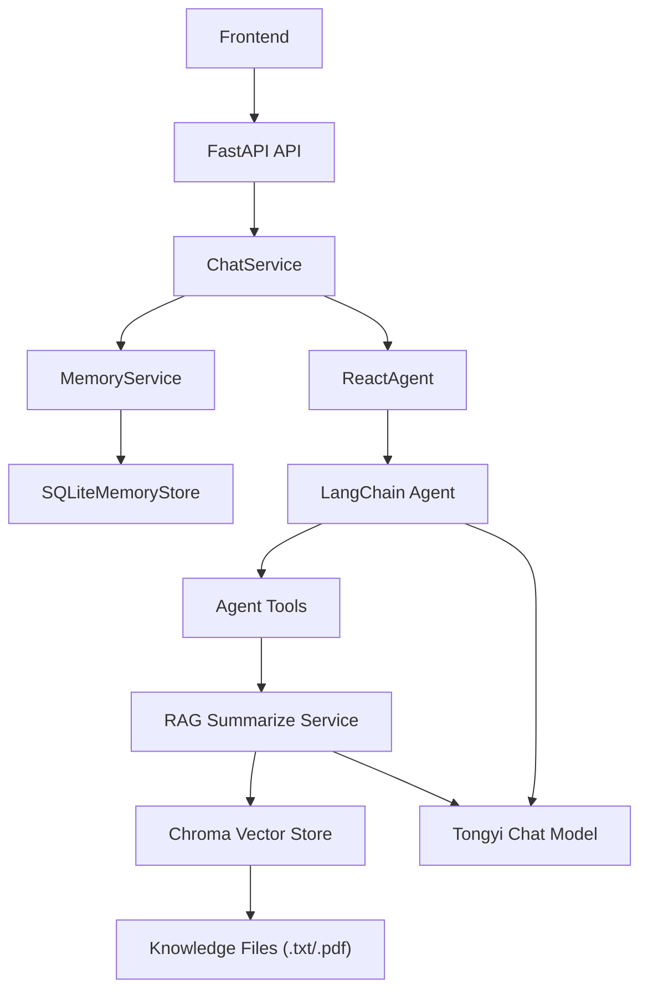

# 客户服务 Agent 项目技术文档

## 1. 文档说明

本文档基于当前项目代码实现生成，面向开发、维护和后续扩展人员，用于说明系统架构、模块分层、运行方式、核心数据流、接口定义与存储设计。

说明范围如下：

- 后端部分按当前代码实现进行说明
- 前端部分忽略页面样式与具体实现细节，仅从 API 调用方式和交互协议角度说明
- 文档结论以项目当前代码为准，不以设计预期或注释中的未来规划为准

项目根目录：`E:\Project\customer_service_agent`

---

## 2. 项目概述

该项目是一个面向智能客服场景的问答系统，当前聚焦于“扫地机器人 / 扫拖一体机器人”相关的咨询问答。系统核心能力由以下几部分组成：

- `FastAPI` 提供后端 HTTP 接口
- `Agent + RAG + LLM` 负责问答生成
- `Chroma` 提供本地知识库向量检索
- `SQLite` 提供长期记忆持久化
- 静态前端页面通过流式接口与后端交互

从当前实现看，系统已经具备以下能力：

- 支持按 `session_id` 维持同一会话的短期上下文
- 支持按 `user_id` 跨会话维护长期记忆
- 支持基于本地文档构建知识库并通过 RAG 检索增强回答
- 支持以 `SSE` 风格流式返回最终结果

---

## 3. 总体架构

### 3.1 架构分层

项目后端整体采用较清晰的分层结构：

- `api`：对外暴露 HTTP 接口
- `services`：业务编排层
- `agents`：Agent、工具、提示词、中间件
- `infra`：模型、向量库、文件加载、SQLite 存储等基础设施
- `core`：配置、路径、日志等底层公共能力

### 3.2 架构关系



### 3.3 核心处理链路

一次问答请求的实际处理顺序如下：

1. 前端向 `POST /api/v1/chat/stream` 发送 `query + session_id + user_id`
2. `ChatService` 调用 `MemoryService.build_memory_context()` 组装长期记忆上下文
3. `ReactAgent.execute_stream()` 使用 `session_id` 作为 `thread_id` 执行 Agent
4. Agent 根据提示词和工具能力决定是否调用 RAG 或其他工具
5. 若调用 `rag_summarize`，则通过 Chroma 检索知识库片段，再交给模型总结
6. `ChatService.event_stream()` 将结果包装为流式事件输出
7. 回答结束后，`MemoryService.extract_and_save()` 从用户输入中抽取长期记忆并写入 SQLite

---

## 4. 目录结构说明

```text
customer_service_agent/
├── backend/
│   ├── app/
│   │   ├── api/                 # API 路由与请求模型
│   │   ├── agents/              # Agent、工具、提示词、中间件
│   │   ├── core/                # 配置、日志、路径
│   │   ├── infra/               # LLM、向量库、文件、记忆存储
│   │   ├── services/            # 业务服务层
│   │   └── main.py              # FastAPI 启动入口
│   ├── data/                    # 知识库原始文档、外部数据、长期记忆 SQLite
│   ├── chroma_db/               # Chroma 持久化目录
│   └── logs/                    # 运行日志
├── config/                      # YAML 配置
├── frontend/                    # 静态前端页面
├── requirements.txt             # Python 依赖
├── README.md
└── 技术文档.md
```

---

## 5. 后端技术栈

当前代码中已明确使用的后端技术栈如下：

- Web 框架：`FastAPI`
- ASGI 服务：`uvicorn`
- 数据校验：`Pydantic v2`
- LLM 编排：`LangChain`
- Agent 状态管理：`LangGraph`
- 向量数据库：`Chroma`
- Embedding 模型：`DashScopeEmbeddings`
- 对话模型：`ChatTongyi`
- 本地存储：`SQLite`
- 配置格式：`YAML`

依赖文件：`E:\Project\customer_service_agent\requirements.txt`

---

## 6. 后端模块设计

### 6.1 API 层

API 层入口在 `backend/app/main.py`。

当前应用初始化逻辑包括：

- 创建 `FastAPI` 实例
- 注册 `CORS` 中间件
- 统一挂载 `/api/v1` 路由前缀
- 引入健康检查和聊天接口

当前 CORS 配置为全开放：

- `allow_origins=["*"]`
- `allow_methods=["*"]`
- `allow_headers=["*"]`
- `allow_credentials=True`

这适合本地联调，但如果进入生产环境，建议改为受限域名白名单。

### 6.2 路由层

当前只有两组路由：

- `health`：健康检查
- `chat`：客服问答

#### 健康检查路由

文件：`backend/app/api/v1/routes/health.py`

- 路径：`GET /api/v1/health`
- 作用：确认后端服务进程是否正常启动

#### 聊天路由

文件：`backend/app/api/v1/routes/chat.py`

- 路径：`POST /api/v1/chat/stream`
- 作用：发起流式问答请求
- 返回：`text/event-stream`

### 6.3 Schema 层

文件：`backend/app/api/v1/schemas/chat.py`

请求模型 `ChatRequest` 定义了 3 个字段：

- `query: str`
- `session_id: str`
- `user_id: str`

字段意义如下：

- `query`：当前轮用户问题
- `session_id`：同一会话 ID，用于绑定短期记忆
- `user_id`：用户 ID，用于绑定长期记忆

这意味着系统显式区分了两类状态：

- 短期会话状态依附于 `session_id`
- 跨会话的长期画像和记忆依附于 `user_id`

---

## 7. 核心业务流程

### 7.1 ChatService

文件：`backend/app/services/chat_service.py`

`ChatService` 是当前问答流程的主编排层，主要负责：

- 调用长期记忆服务生成 `memory_context`
- 调用 Agent 执行问答
- 将输出包装成 SSE 流
- 在回答结束后触发长期记忆抽取与持久化

其核心方法有两个：

#### `execute_stream(query, session_id, user_id)`

职责：

- 根据 `user_id` 读取长期记忆
- 生成注入给 Agent 的 `memory_context`
- 调用 `ReactAgent.execute_stream()`

#### `event_stream(query, session_id, user_id)`

职责：

- 向前端先发送一个 `snapshot` 事件，内容为“正在思考中...”
- 持续消费 Agent 的流式输出
- 当前实现只保留最后一个非空快照作为最终答案
- 回答结束后写入长期记忆
- 发送一个 `final` 事件给前端

这说明当前虽然使用了流式协议，但前端实际上只展示：

- 一次占位快照
- 一次最终答案

中间推理过程不会持续逐字展示。

### 7.2 ReactAgent

文件：`backend/app/agents/react_agent.py`

`ReactAgent` 封装了基于 LangChain / LangGraph 的 Agent 执行逻辑。

当前实现特点：

- 使用 `create_agent()` 创建 Agent
- 使用 `InMemorySaver()` 作为 checkpointer
- 使用 `session_id -> thread_id` 维持同一会话的短期记忆
- 通过 `context={"report": False, "memory_context": memory_context}` 注入额外上下文

当前注册的工具包括：

- `rag_summarize`
- `get_weather`
- `get_user_location`
- `get_user_id`
- `get_current_month`
- `fetch_external_data`
- `fill_context_for_report`

当前中间件包括：

- `monitor_tool`
- `log_before_model`
- `report_prompt_switch`

需要注意的是，短期记忆当前只保存在进程内存中，因此：

- 同一服务进程内，`session_id` 可用于连续对话
- 服务重启后，短期会话上下文会丢失

---

## 8. RAG 设计

### 8.1 RAG 服务职责

文件：`backend/app/agents/support/rag_support.py`

`RagSummarizeService` 负责：

- 初始化向量库
- 执行知识库检索
- 将检索结果拼成上下文
- 调用大模型生成总结性回答

### 8.2 初始化策略

系统启动后，RAG 服务会检查以下内容是否存在：

- `config/chroma.yml` 中定义的 `md5_hex_store`
- `config/chroma.yml` 中定义的 `persist_directory`

若二者不存在，则自动加载知识库文档并构建向量索引。

这意味着系统具备“首次运行自动初始化知识库”的能力。

### 8.3 向量库实现

文件：`backend/app/infra/vectorstore/chroma_store.py`

`VectorStoreService` 的核心职责：

- 读取知识库目录中的文件
- 支持 `txt` 与 `pdf` 文件加载
- 按配置切分文档块
- 写入 Chroma
- 通过 MD5 防止重复入库

当前关键配置如下：

- 集合名：`agent`
- 持久化目录：`backend/chroma_db`
- 检索 TopK：`3`
- 知识库目录：`backend/data`
- 允许文件类型：`txt`、`pdf`
- 切块大小：`200`
- 切块重叠：`20`

### 8.4 文件加载

文件：`backend/app/infra/files/file_loader.py`

支持的加载方式：

- `txt_loader()`：读取文本文件
- `pdf_loader()`：读取 PDF

同时提供：

- `get_file_md5_hex()`：生成文件 MD5
- `listdir_with_allowed_type()`：筛选允许入库的文件类型

### 8.5 RAG 调用方式

Agent 工具 `rag_summarize(query)` 内部调用 `RagSummarizeService.rag_summarize(query)`，处理流程如下：

1. 检索知识库文档
2. 将文档片段拼接为 `context`
3. 通过 RAG Prompt 模板组织输入
4. 调用对话模型生成结果

---

## 9. 长期记忆设计

### 9.1 设计目标

长期记忆用于保存跨会话仍然有价值的用户信息，例如：

- 用户姓名
- 所在城市
- 设备型号
- 户型
- 是否养宠物
- 预算范围
- 偏好
- 历史问题背景

### 9.2 核心服务

文件：`backend/app/services/memory_service.py`

`MemoryService` 主要负责三件事：

1. 读取长期记忆并构造成可注入的上下文
2. 根据用户问题提取候选记忆
3. 将抽取结果写入 SQLite

### 9.3 记忆注入

`build_memory_context(user_id, query)` 的逻辑：

- 先读取用户画像
- 再检索与当前问题相关的历史记忆
- 拼接成结构化文本
- 以 `[长期记忆]` 开头注入给 Agent

当前检索策略较轻量：

- 先对当前 query 做简单关键词拆分
- 再用“关键词是否出现在 memory content 中”的方式做匹配
- 若没有命中，则回退到最近更新的若干条记忆

当前不是向量化记忆检索，而是规则 + 关键词匹配。

### 9.4 记忆抽取

`extract_and_save(user_id, query, final_answer)` 会在回答结束后执行。

当前版本采用规则抽取，不使用模型抽取。规则主要识别：

- 地点
- 姓名
- 产品型号
- 预算
- 是否有宠物
- 偏好关键词
- 历史故障/问题背景
- 明确要求系统“记住”的偏好信息

这意味着当前长期记忆具备以下特征：

- 实现简单，稳定性高
- 可解释性强
- 覆盖范围有限
- 更适合早期验证

### 9.5 存储实现

文件：`backend/app/infra/memory/sqlite_store.py`

长期记忆使用本地 SQLite 存储，路径来自：

- `config/memory.yml`
- 当前值：`backend/data/memory/long_term_memory.sqlite3`

SQLite 中维护两张表：

#### `user_profiles`

用于保存结构化用户画像，字段包括：

- `user_id`
- `name`
- `location`
- `product_model`
- `home_type`
- `has_pet`
- `budget_range`
- `preferences_json`
- `updated_at`

#### `user_memories`

用于保存非结构化长期记忆条目，字段包括：

- `id`
- `user_id`
- `memory_type`
- `content`
- `source`
- `importance`
- `created_at`
- `updated_at`
- `is_active`

### 9.6 去重策略

当前记忆去重规则为精确匹配：

- 同一 `user_id`
- 同一 `memory_type`
- 同一 `content`

完全一致时不重复写入。

---

## 10. 模型与配置设计

### 10.1 配置加载方式

文件：`backend/app/core/config.py`

系统通过统一配置加载器读取 YAML 配置：

- `config/rag.yml`
- `config/chroma.yml`
- `config/prompts.yml`
- `config/agent.yml`
- `config/memory.yml`

所有配置路径都通过 `backend/app/core/paths.py` 中的 `get_abs_path()` 转为项目根目录下的绝对路径。

### 10.2 模型工厂

文件：`backend/app/infra/llm/factory.py`

当前定义了两个工厂：

- `ChatModelFactory`
- `EmbeddingsFactory`

当前模型配置如下：

- 聊天模型：`qwen-plus`
- 向量模型：`text-embedding-v4`

### 10.3 Prompt 管理

文件：`backend/app/agents/support/prompt_support.py`

Prompt 通过配置文件管理，再从磁盘加载文本内容。当前支持：

- 系统主 Prompt
- RAG 总结 Prompt
- 报告生成 Prompt

另外，`append_memory_context()` 用于将长期记忆拼接到基础 Prompt 后面。

---

## 11. 外部工具与辅助数据

文件：`backend/app/agents/tools/agent_tools.py`

当前工具大致可分为 3 类：

### 11.1 知识库工具

- `rag_summarize(query)`

用于调用知识库检索与总结链路。

### 11.2 模拟环境工具

- `get_weather(city)`
- `get_user_location()`
- `get_user_id()`
- `get_current_month()`

这些工具当前更接近演示或占位实现。例如：

- `get_weather` 返回固定天气描述
- `get_user_location` 和 `get_user_id` 通过随机值模拟
- `get_current_month` 从预置月份数组随机返回

因此这些工具更适合 Demo 或流程验证，不适合作为真实生产数据源。

### 11.3 外部数据读取工具

- `fetch_external_data(user_id, month)`

该工具从 `backend/data/external/records.csv` 中读取外部记录，并缓存在进程内存中。适用于模拟从外部业务系统获取用户某月使用数据的场景。

---

## 12. API 接口文档

本节只从接口视角描述前后端交互，不展开前端页面实现。

### 12.1 健康检查接口

#### 基本信息

- 方法：`GET`
- 路径：`/api/v1/health`
- 响应类型：`application/json`

#### 响应示例

```json
{
  "status": "ok"
}
```

#### 使用场景

- 服务启动后健康探测
- 部署环境连通性检查
- 前端或运维脚本做简单可用性验证

---

### 12.2 流式聊天接口

#### 基本信息

- 方法：`POST`
- 路径：`/api/v1/chat/stream`
- 请求类型：`application/json`
- 响应类型：`text/event-stream`

#### 请求参数

```json
{
  "query": "当前环境下应该怎么保养机器人？",
  "session_id": "demo-session-id",
  "user_id": "demo-user-id"
}
```

#### 字段说明

| 字段 | 类型 | 必填 | 说明 |
| --- | --- | --- | --- |
| `query` | `string` | 是 | 当前轮用户输入 |
| `session_id` | `string` | 是 | 会话 ID，用于短期记忆绑定 |
| `user_id` | `string` | 是 | 用户 ID，用于长期记忆绑定 |

#### 返回协议

接口采用 `SSE` 风格返回，当前实现会发送两类事件数据，格式统一为：

```text
data: {"type":"事件类型","content":"事件内容"}

```

#### 事件类型

##### 1. `snapshot`

表示临时状态或处理中状态。

当前固定会先返回：

```json
{
  "type": "snapshot",
  "content": "正在思考中..."
}
```

##### 2. `final`

表示最终答案。

示例：

```json
{
  "type": "final",
  "content": "建议每周清理滚刷、边刷和尘盒，并根据地面材质调整拖布清洗频率。"
}
```

#### 前端消费方式

根据 `frontend/app.js`，前端消费逻辑如下：

1. 使用 `fetch()` 调用接口
2. 请求头声明：
   - `Content-Type: application/json`
   - `Accept: text/event-stream`
3. 通过 `response.body.getReader()` 逐段读取流
4. 以 `\n\n` 作为单个 SSE 事件的分隔符
5. 提取 `data: ` 开头的行
6. `JSON.parse()` 解析事件数据
7. 根据 `type` 更新界面

#### 会话行为说明

前端会在本地存储中保存：

- `chat-session-id`
- `chat-user-id`

行为规则如下：

- 正常连续提问时沿用同一个 `session_id`
- 点击“清空会话”时只重置 `session_id`
- `user_id` 保持不变，用于延续长期记忆

这意味着：

- “清空会话”只会中断短期上下文
- 长期用户画像和长期记忆仍然保留

#### 错误处理

前端当前仅做了基础错误处理：

- 如果 HTTP 状态非 2xx，抛出异常
- 如果 `response.body` 不存在，抛出异常
- 如果请求失败，则在界面显示“请求失败: <error.message>”

后端当前未单独定义统一错误码结构。

---

## 13. 运行与部署说明

### 13.1 安装依赖

在项目根目录执行：

```powershell
pip install -r requirements.txt
```

### 13.2 启动后端

```powershell
uvicorn backend.app.main:app --reload
```

默认访问地址：

- API 根地址：`http://127.0.0.1:8000`
- 健康检查：`http://127.0.0.1:8000/api/v1/health`
- Swagger 文档：`http://127.0.0.1:8000/docs`

### 13.3 启动前端

```powershell
python -m http.server 5500 -d frontend
```

默认访问地址：

- 前端页面：`http://127.0.0.1:5500`

### 13.4 首次启动注意事项

首次启动并触发 RAG 查询时，系统可能自动初始化向量库：

- 读取 `backend/data` 下的 `.txt` / `.pdf` 文件
- 执行切块和向量化
- 持久化到 `backend/chroma_db`

如果知识库文档较多，首次初始化会比平时更慢。

---

## 14. 当前数据资产

### 14.1 知识库数据

目录：`backend/data`

当前已存在的知识库文件包括：

- `选购指南.txt`
- `维护保养.txt`
- `故障排除.txt`
- `扫拖一体机器人100问.txt`
- `扫地机器人100问2.txt`
- `扫地机器人100问.pdf`

### 14.2 外部模拟数据

目录：`backend/data/external`

文件：

- `records.csv`

用于模拟外部业务系统中的用户记录。

### 14.3 长期记忆数据

目录：`backend/data/memory`

文件：

- `long_term_memory.sqlite3`

用于保存用户画像与长期记忆条目。

---

## 15. 非功能性特征

### 15.1 可维护性

项目已经具备一定可维护性基础：

- 配置外置化
- 路由与服务解耦
- 存储层独立
- RAG、记忆、Agent 分层明确

### 15.2 可扩展性

当前结构适合后续扩展以下方向：

- 新增更多 API 路由
- 接入真实天气或用户信息服务
- 将短期记忆从内存改为持久化存储
- 将长期记忆检索升级为向量化召回
- 增加后台管理、知识库管理、会话管理模块

### 15.3 运行限制

当前实现存在以下明显限制：

- 短期记忆依赖 `InMemorySaver`，服务重启即丢失
- 工具中的外部数据和天气能力多数为模拟实现
- 长期记忆抽取是规则式，不是模型式
- 长期记忆检索是关键词匹配，不是语义检索
- 当前流式接口协议简单，未定义 `event id`、重试机制或标准事件名
- CORS 为全开放，仅适合开发环境

---

## 16. 已知实现结论

基于当前代码，可以明确得出以下技术结论：

1. 这是一个以后端为核心的智能客服系统原型，而不是单纯的聊天页面项目
2. 当前最完整、最稳定的主链路是“客服问答 + RAG 检索 + 长期记忆注入”
3. 前端当前主要承担输入、展示和流式消费职责，业务状态主要由后端管理
4. 系统已经完成从单体 Demo 向前后端分离结构的重构
5. 数据层当前以本地文件、Chroma、SQLite 为主，适合开发验证和原型演示

---

## 17. 后续优化建议

如果后续继续演进，建议优先考虑以下方向：

### 17.1 接口层

- 增加统一错误响应格式
- 增加接口版本治理策略
- 为聊天接口补充超时、取消、限流设计

### 17.2 会话与记忆

- 将短期记忆持久化，避免服务重启丢失上下文
- 为长期记忆增加更新时间策略、失效策略和人工修正能力
- 将长期记忆检索升级为语义检索

### 17.3 RAG 能力

- 增加文档元数据管理
- 增加知识库重建与增量更新机制
- 增加检索结果可解释性输出

### 17.4 工程化

- 补充单元测试与接口测试
- 引入环境变量管理密钥与模型配置
- 增加容器化部署方式
- 增加生产级日志与监控能力

---

## 18. 文档适用结论

这份技术文档适合用于以下场景：

- 项目交接
- 新成员快速了解系统
- 后续进行接口扩展或架构重构前的现状盘点
- 编写毕业设计、课程设计或阶段性汇报中的“系统实现”章节

如果后续你愿意，我还可以继续基于这份文档再帮你补两版内容：

- 一版“更偏论文/毕设写法”的系统设计文档
- 一版“更偏工程交付”的接口文档 + 部署文档 + 数据库文档拆分版
